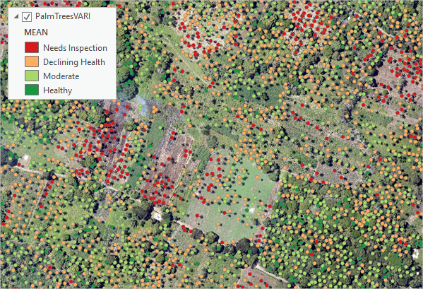

# Object Detection GisPro

Проекты по обнаружению обьектов при помощи API GisPro. 

Данные - спутниковые снимки, снимки с беспилотников

[Проект 1. - Обнаружение бассейнов в частном секторе по спутниковым снимкам](https://github.com/SergeyShchus/Object-Detection-GisPro/tree/master/project/Detection_pool/Notebooks)

[Проект 2. - Обнаружение пальм и их состояния по ортофото](https://github.com/SergeyShchus/Object-Detection-GisPro/tree/master/project/Detection_palm)

